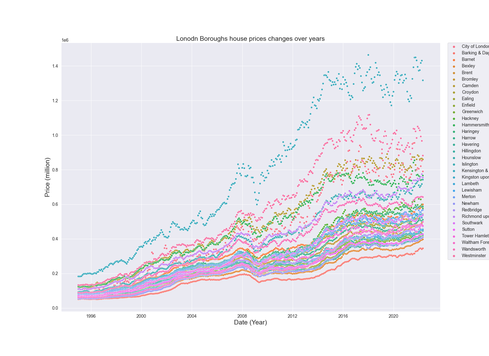

## Objectives

Here’s we’re going to solve: ***which boroughs of London have seen the greatest increase in housing prices, on average, over the last two decades?***


A borough is just a fancy word for district. You may be familiar with the five boroughs of New York… well, there are 32 boroughs within Greater London [(here's some info for the curious)](https://en.wikipedia.org/wiki/London_boroughs). Some of them are more desirable areas to live in, and the data will reflect that with a greater rise in housing prices.


### 1. Sourcing and Loading 


#### 1.1. Importing Libraries


```python
# Let's import the pandas, numpy libraries as pd, and np respectively. 
import pandas as pd
import numpy as np


# Load the pyplot collection of functions from matplotlib, as plt 
from matplotlib import pyplot as plt
```

#### 1.2.  Loading the data
Your data comes from the [London Datastore](https://data.london.gov.uk/): a free, open-source data-sharing portal for London-oriented datasets. 


```python
# First, make a variable called url_LondonHousePrices, and assign it the following link, enclosed in quotation-marks as a string:

url_LondonHousePrices = "https://data.london.gov.uk/download/uk-house-price-index/70ac0766-8902-4eb5-aab5-01951aaed773/UK%20House%20price%20index.xls"

# The dataset we're interested in contains the Average prices of the houses, and is actually on a particular sheet of the Excel file. 
# As a result, we need to specify the sheet name in the read_excel() method.
# Put this data into a variable called properties.  
properties = pd.read_excel(url_LondonHousePrices, sheet_name='Average price', index_col= None)

properties.head(10)
```


```python
# Making copy Transposed dataframe
Data_copy = properties.T
Data_copy.head()
```


```python
# Use 3 decimal places in output display
pd.set_option("display.precision", 3)
```

```python
Data_copy.index
```

Since the Boroughs name is index it should be resetted cause it is one of the feature that we will work on.

```python
# Call the .reset_index() method on Data_copy to reset the indices, and the reassign the result to properties_T: 
Data_copy = Data_copy.reset_index()
```

```python
Data_copy.index
```

```python
Data_copy.head()
```

```python
# Call the iloc[] method with double square brackets on the properties_T DataFrame, to see the row at index 0. 
Data_copy.columns = Data_copy.iloc[0]
```

```python
# Have a go at this now. 
Data_copy = Data_copy.drop(0)
Data_copy.head()

```

<iframe src = "/img/london_borough/indextable.html" height = "300px" width ="100%"></iframe>


### 2. Cleaning, transforming, and visualizing
The end goal of data cleaning is to have tidy data. When data is tidy: 

1. Each variable has a column.
2. Each observation forms a row.


```python
# Try this here. 
Data_copy = Data_copy.rename(columns = {'Unnamed: 0':'London_Borough', pd.NaT: 'ID'}) 
Data_copy.head()
```
```python
Data_copy.columns
```

```python
# Using Melt function to make dataframe tidier
Data_copy_clean = pd.melt(Data_copy, id_vars= ['London_Borough', 'ID'])
Data_copy_clean.head()
```

```python
# Re-name the column names
Data_copy_clean = Data_copy_clean.rename(columns = {0: 'Month', 'value': 'Average_price'})
Data_copy_clean.head()
```

```python
# Let's use the .dtypes attribute to check the data types of our clean_properties DataFrame:
Data_copy_clean.dtypes
```

```python
# Lets change price datatype from object to float
Data_copy_clean['Average_price'] = Data_copy_clean['Average_price'].astype('float')
```

```python
Data_copy_clean.dtypes
```

```python
Data_copy_clean.count()
```
```python
# lets check how many unique observation we have. 
Data_copy_clean['London_Borough'].unique()
```

Some of these strings are not London boroughs. 
The strings that don't belong:

    'Unnamed: 34'
    'Unnamed: 37'
    'NORTH EAST'
    'NORTH WEST'
    'YORKS & THE HUMBER'
    'EAST MIDLANDS'
    'WEST MIDLANDS'
    'EAST OF ENGLAND'
    'LONDON'
    'SOUTH EAST'
    'SOUTH WEST'
    'Unnamed: 47'
    'England'
Let see what information is contained in rows where London_Boroughs is 'Unnamed’ and, if there’s nothing valuable, we can drop them. To investigate, subset the clean_properties DataFrame on this condition.

```python
Data_copy_clean.dropna()
# Check the shape of dataframe
Data_copy.shape
```
```python
Data_copy_clean.count()
```

```python
NaNFreeDF1 = Data_copy_clean[Data_copy_clean['Average_price'].notna()]
NaNFreeDF1.head(48) 
```

```python
NaNFreeDF1.count()
```

```python
NaNFreeDF1['London_Borough'].unique()
```

```python
print(Data_copy_clean.shape)
print(NaNFreeDF1.shape)
# print(NaNFreeDF2.shape)
```

Drop the rest of the invalid 'London Borough' values.

An elegant way to do this is to make a list of all those invalid values, then use the *isin()* method, combined with the negation operator *~*, to remove those values. Call this list *nonBoroughs*.

```python
# A list of non-boroughs. 
nonBoroughs = ['Inner London', 'Outer London', 
               'NORTH EAST', 'NORTH WEST', 'YORKS & THE HUMBER', 
               'EAST MIDLANDS', 'WEST MIDLANDS',
              'EAST OF ENGLAND', 'LONDON', 'SOUTH EAST', 
              'SOUTH WEST', 'England']
```

```python
NaNFreeDF1 = NaNFreeDF1[~NaNFreeDF1.London_Borough.isin(nonBoroughs)]
```

```python
NaNFreeDF1.head()

```

<iframe src = "/img/london_borough/indextc.html" height = "300px" width ="100%"></iframe>


```python
df = NaNFreeDF1
```

**2.4.Visualizing Data**


```python
import matplotlib.pyplot as plt
```

```python
# First of all, lets make a variable called camden_prices, and assign it the result of filtering df on the following condition:
# df['London_Borough'] == 'Camden'
camden_prices = df[df['London_Borough'] == 'Camden']
plt.figure(figsize=(30,10))
# Make a variable called ax. Assign it the result of calling the plot() method, and plugging in the following values as parameters:
# kind ='line', x = 'Month', y='Average_price'
ax = camden_prices.plot(kind ='line', x = 'Month', y='Average_price')

# Finally, call the set_ylabel() method on ax, and set that label to the string: 'Price'. 
ax.set_ylabel('Price')
ax.set_xlabel('Year')
ax.set_title("Camden`s House Price Change Over the Year")
plt.savefig("CamdanPrice.png")
```

# 

```python
import seaborn as sns

import matplotlib_inline

```


```python
# Plotting Lonodn Boroughs house prices changes over years

plt.figure(figsize=(22,16))
sns.set(font_scale=1.3)

sns.scatterplot(x = df.Month,y = df.Average_price,data=df, hue ='London_Borough')
plt.legend(bbox_to_anchor=(1.02, 1), loc='upper left', borderaxespad=0)

# Set x-axis label
plt.xlabel('Date (Year)', fontsize =21)
# Set y-axis label
plt.ylabel('Price (million)', fontsize =21)
plt.title("Lonodn Boroughs house prices changes over years",fontsize =21);

```

<!--  -->
# 


To limit the amount of temporal data-points you have, it would be useful to extract the year from every value in our Month column. 300 is more datapoints than needed.

```python
# Try this yourself. 
df['Year'] = df['Month'].apply(lambda t: t.year)
df.tail()
```

```python
# Using the function 'groupby' will help you to calculate the mean for each year and for each Borough. 
## As you can see, the variables Borough and Year are now indices
dfg = df.groupby(by=['London_Borough', 'Year']).mean()
dfg.sample(10)

```

```python
# Let's reset the index for our new DataFrame dfg, and call the head() method on it. 
dfg = dfg.reset_index()
dfg.head()

```

**3. Modeling**

We will create a function that will calculate a ratio of house prices, comparing the price of a house in 2018 to the price in 1998.

This function will:
1. Take a filter of dataframe, specifically where this filter constrains the London_Borough, as an argument. For example, one admissible argument should be: dataframe[dataframe['London_Borough']=='Camden'].
2. Get the Average Price for that Borough, for the years 1998 and 2018.
4. Calculate the ratio of the Average Price for 1998 divided by the Average Price for 2018.
5. Return that ratio.

Once you've written this function, you ultimately want to use it to iterate through all the unique London_Boroughs and work out the ratio capturing the difference of house prices between 1998 and 2018.


```python
# Here's where you should write your function:
def create_price_ratio(d):
    y1998 = float(d['Average_price'][d['Year']==1998])
    y2018 = float(d['Average_price'][d['Year']==2018])
    ratio = [y2018/y1998]
    return ratio

```

```python
#  Test out the function by calling it with the following argument:
# dfg[dfg['London_Borough']=='Barking & Dagenham']
create_price_ratio(dfg[dfg['London_Borough']=='Barking & Dagenham'])
```

```python
# We want to do this for all of the London Boroughs. 
# First, let's make an empty dictionary, called final, where we'll store our ratios for each unique London_Borough.
final = {}
```

```python
# Now let's declare a for loop that will iterate through each of the unique elements of the 'London_Borough' column of our DataFrame dfg.
# Call the iterator variable 'b'. 
for b in dfg['London_Borough'].unique():
    # Let's make our parameter to our create_price_ratio function: i.e., we subset dfg on 'London_Borough' == b. 
    borough = dfg[dfg['London_Borough'] == b]
    # Make a new entry in the final dictionary whose value's the result of calling create_price_ratio with the argument: borough
    final[b] = create_price_ratio(borough)
# We use the function and incorporate that into a new key of the dictionary 
print(final) 
```

```python
# Make a variable called df_ratios, and assign it the result of calling the DataFrame method on the dictionary final. 
df_ratios = pd.DataFrame(final)
df_ratios
```

```python
# All we need to do now is transpose it, and reset the index! 
df_ratios_T = df_ratios.T
df_ratios = df_ratios_T.reset_index()
df_ratios.head()
```

```python
# Let's just rename the 'index' column as 'London_Borough', and the '0' column to '2018'.
df_ratios.rename(columns={'index':'Borough', 0:'2018'}, inplace=True)
df_ratios.head()
```

```python
top15 = df_ratios.sort_values(by='2018',ascending=False).head(15)
print(top15)

```

